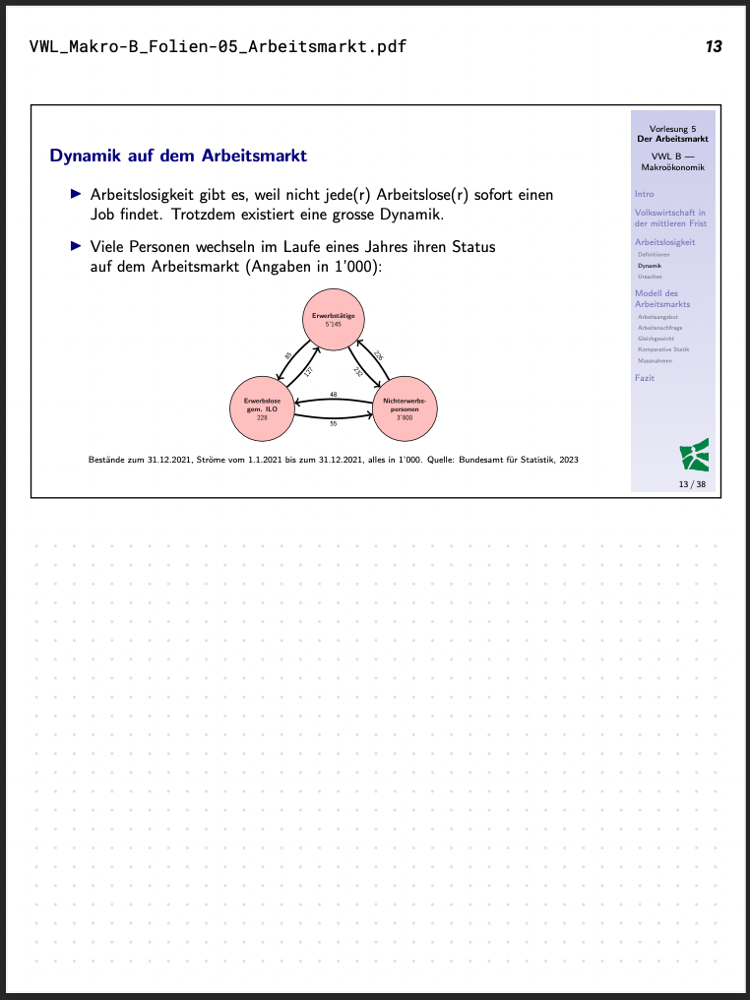
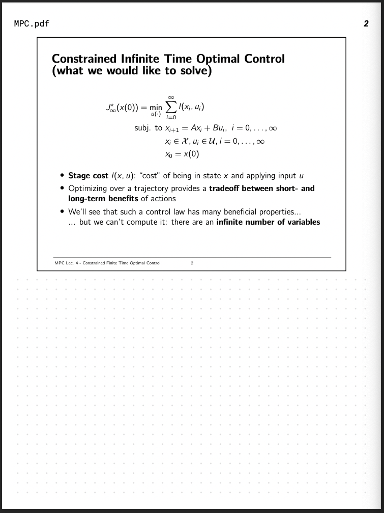
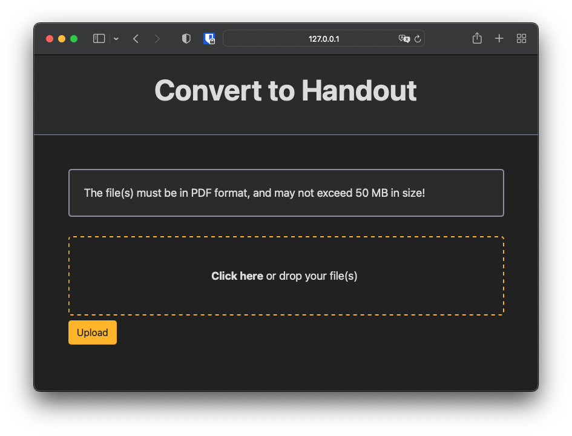
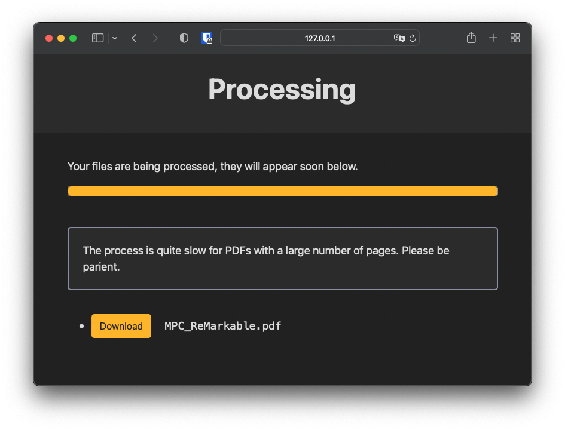

# Slides for ReMarkable

Convert slides to handouts to take notes with the ReMarkable tablet.

**NOTE:** I built this in an afternoon, and it is very inefficient, but it works! I'll improve it when I find some time. Self host at your own risk.

## Sample outputs

## Web interface

